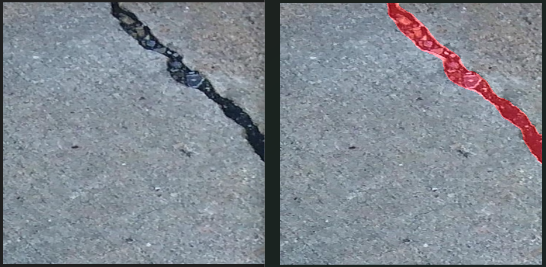

# 🧱 Crack Detection — Deep Learning + Flask Web App

A complete end-to-end system for **crack segmentation and detection** using **U-Net (ResNet50 encoder)** and a lightweight **Flask web interface** for real-time inference.  
This project allows training, inference, and deployment of a crack segmentation model, along with planned support for crack measurement and classification.

---
# 🧪 Input image vs Output image


## 🧪 Demo


---
## 📂 Project Structure

```
.
├── app.py                    # Flask web application
├── templates/                # HTML templates for the UI
├── train.py                  # Model training script
├── inference_utils.py        # Inference utilities
├── data_agumentation.py      # Image augmentation pipeline
├── dataset_download.py       # Kaggle dataset helper
├── masks_cleaning.py         # Mask post-processing
├── requirements.txt          # Dependencies
├── README.md
└── .gitignore
```

---

## ⚙️ Installation & Setup

```bash
# Clone the repository
git clone https://github.com/swar09/crack-detection.git
cd crack-detection

# (Optional) Create and activate virtual environment
python -m venv venv
source venv/bin/activate          # On Windows: venv\Scripts\activate

# Install dependencies
pip install --upgrade pip
pip install -r requirements.txt
```


---

## 📦 Dependencies

- torch, torchvision, segmentation-models-pytorch
- albumentations, opencv-python
- numpy, pandas, tqdm, matplotlib
- Flask
- kaggle *(for dataset download)*
- For Inference only **[best_model.pth](https://drive.google.com/file/d/16HRyJpR2TVhT6cG2LNY-pmLkYKbjNpfv/view?usp=sharing)**  

---

## 🧾 Dataset

We use the **[Crack Segmentation Dataset](https://www.kaggle.com/datasets/lakshaymiddha/crack-segmentation-dataset)**  
📸 Author: *Lakshay Middha* (Kaggle contributor) — all credit for the dataset goes to the original author.

This dataset contains over 11,000 images and segmentation masks sourced from multiple crack detection datasets.

### 📥 Download Options

#### Option 1 — Using Kaggle CLI
```bash
pip install kaggle
kaggle datasets download -d lakshaymiddha/crack-segmentation-dataset -p ./data --unzip
```

#### Option 2 — Using the Helper Script
```bash
python dataset_download.py
```
#### Setup Data Augmentation (virtual dataset) 
```bash
python data_agumentation.py
```
#### Data cleaning (Applying binary-threshold)  
```bash
python masks_cleaning.py
```
Expected structure:
```
Dataset/
  train/
    images/
    masks/
  val/
    images/
    masks/
  test/
    images/
    masks/
```

---

## 🧠 Model Training

```bash
python train.py
```

- Tune hyperparameters in `train.py` (BATCH_SIZE, EPOCHS, IMAGE_SIZE, etc.).
- Checkpoints saved to `weights/`.
- Logs saved to `logs/`.
- Predictions saved in `results/`.

🛠 Tech: U-Net (ResNet50 backbone) + BCE Loss + Dice Score.

---

## 🌐 Running the Flask Web App

```bash
export FLASK_APP=app.py       # Windows PowerShell: $env:FLASK_APP="app.py"
flask run
```

or

```bash
python app.py
```

Then visit 👉 [http://localhost:5000](http://localhost:5000)

---

## 🧪 Inference via CLI

```bash
python inference_utils.py --image path/to/image.jpg --weights weights/best_model.pth
```

---

## 🧭 Future Work

- 🖌 Manual Masking Tool — manual annotation and mask refinement.
- 🧬 Feature Engineering — compute geometric & statistical features.
- 📏 Size / Area / Depth Estimation of detected cracks.
- 🧭 Crack Classification — categorize crack types (e.g., longitudinal, transverse, alligator).
- ☁️ Optional: integrate cloud storage & APIs for batch processing.

---

## 🤝 Contributing

Pull requests and feedback are welcome!

1. Fork the repo
2. Create a new branch
3. Commit your changes
4. Open a PR with a clear description

---

## 🪪 License

This project is licensed under the **MIT License**.

---

## 🙏 Acknowledgements

- Dataset: [Lakshay Middha](https://www.kaggle.com/datasets/lakshaymiddha/crack-segmentation-dataset)
- Segmentation Models: [segmentation-models-pytorch](https://github.com/qubvel/segmentation_models.pytorch)
- Framework: [Flask](https://flask.palletsprojects.com/)


